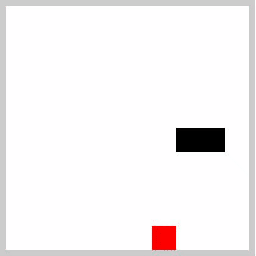

   
   <h1>Sneak Game</h1>

    
    

    

   <a href="#pushpin-info">Info</a>

## :pushpin: Info
Repositório referente ao projeto de recriação do jogo da cobrinha utilizando HTML, CSS e JavaScript ministrado peloa Digital Innovation One.

Na pasta <b>1st-proof-of-concept</b> foi incluído alguns conceitos de arquitetura de software e estrutura de dados que o Felipe Deschamps abordou na playlist do Joguinho Multiplayer.

---
Made by Gabriel Sousa
